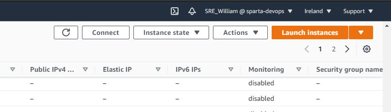
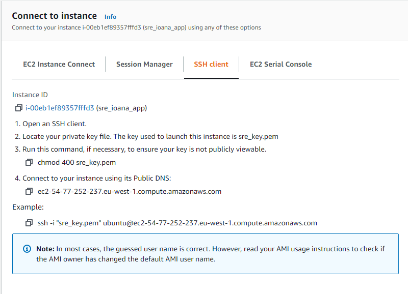

# Creating 2 tier architecture with AWS

We have a created 2 VM's called "app" and "db" on our loclhost machine and configured the in the way we want to. The goal now is to migrate these machines to AWS such that they are hosted **remotely**, rather then locally.

## Moving "app" and "db" VM's to AWS
---
#### Initialising the "app" machine on AWS
---
- Firstly, ensure that the selected server is Ireland, eu-west-1
- Initiliase an EC2 instance with the correct version of Ubuntu [Ubuntu 16.04 - LTS(HVM)].
- Instance type should be left as t2.micro (1 CPU and 1 GB memory)
    - --> NEXT PAGE
- Leave number of instances as 1.
- Leave the Network as default [vpc-07e47e9d90d2076da (default)]
- Select the Subnet that ends in [DevOpsStudent default 1a | Default in eu-west-1a]
- Auto-assign Public IP must be set as "Enabled"
- All other settings should be left alone, they DO NOT need to be changed
    - --> NEXT PAGE
- The storage allocated to the machine should be left alone.
    - --> NEXT PAGE
- Add a tag with the label "Name" and name it according with the correct naming convention, e.g. `SRE_will_app`
    - --> NEXT PAGE
- The security group name needs to be named under the same naming convention as the machines Name tag (`SRE_will_app_SG`). The description can have extra details or copy the security group name.
- Leave the default SSH port 22, this is required.
- Add a rule > SSH with your own private IPV4 address.
- Add a rule > HTTP with 0.0.0.0 IP address, to allow for public access from any IP.
    - --> REVIEW AND LAUNCH
- Choose an existing key, choose the relevant (sre_key.pem) > **Launch the machine**

---
We can also add the `port 3000` rule now as well, or complete this later. To add this later, edit the inbound rules on the security group.

Navigate to the security groups for the VM and add an inbound rule.
- The port should be `3000`
- `Source` should be set to `Anywhere-IPV4`.

#### Initialising the "db" machine on AWS
---
- Firstly, ensure that the selected server is Ireland, eu-west-1
- Initiliase an EC2 instance with the correct version of Ubuntu [Ubuntu 16.04 - LTS(HVM)].
- Instance type should be left as t2.micro (1 CPU and 1 GB memory)
    - --> NEXT PAGE
- Leave number of instances as 1.
- Leave the Network as default [vpc-07e47e9d90d2076da (default)]
- Select the Subnet that ends in [DevOpsStudent default 1a | Default in eu-west-1a]
- Auto-assign Public IP must be set as "Enabled"
- All other settings should be left alone, they DO NOT need to be changed
    - --> NEXT PAGE
- The storage allocated to the machine should be left alone.
    - --> NEXT PAGE
- Add a tag with the label "Name" and name it according with the correct naming convention, e.g. `SRE_will_db`
    - --> NEXT PAGE
- The security group name needs to be named under the same naming convention as the machines Name tag. The description can have extra details or copy the security group name.
- Leave the default SSH port 22, this is required.
- Add a custom TCP rule for the port 27017 with the public IP address of the "app" machine. This will allow the "app" machine to access this machine

    

    - --> REVIEW AND LAUNCH
- Choose an existing key, choose the relevant (sre_key.pem) > **Launch the machine**


#### Access a machine through the terminal
---
- Get the key and save it in a memorable directory.
- Navigate to the directory and change the permissions for the key file to read only > `chmod 400 sre_key.pem`
- On AWS go to the connect tab for the instance to obtain the remote name of the machine e.g. `ubuntu@ec2-3-250-79-225.eu-west-1.compute.amazonaws.com`

    
    

- Connect to the machine > `ssh -i "sre_key.pem" ubuntu@ec2-3-250-79-225.eu-west-1.compute.amazonaws.com`


## Provisioning the machines
---
#### Provision the "app" machine
---
To provision this "app" machine, the process is almost exactly the same as provisioning the locally hosted "app" machine. Here is the `provision.sh` file used to provision the remotely hosted "app" machine:
```
!#/bin/bash

sudo apt-get update -y
sudo apt-get upgrade -y


sudo apt-get install nginx -y

sudo apt-get install npm -y
sudo apt-get install python-software-properties -y
curl -sL https://deb.nodesource.com/setup_6.x | sudo -E bash -
sudo apt-get install nodejs -y

sudo npm install pm2 -g -y
```


#### Syncing the app folder
---
**This is compeleted from the localhost terminal**

We need the app folder to be available on the Ubuntu VM. It is already available on our local machine, so all we need to do is copy from our machine, to the remote Ubuntu machine. This is done using the `scp` command:
```
scp -ri ~/.ssh/sre_key.pem ~/Documents/AWS\ Stuff/Move_app_and_db_to_AWS/app ubuntu@3.250.79.225:/home/ubuntu/app
```

The basic syntax for this command is
```
scp [OPTION] [user@]SRC_HOST:]file1 [user@]DEST_HOST:]file2
```
We then need to confirm we want to do this.

#### Provision the "db" machine
---
Again, provisioning the "db" machine is almost exactly the same as when it was locally hosted
```
!#/bin/bash

#Sets up machine (ensures all things work)
sudo apt-get update -y
sudo apt-get upgrade -y

#Adding MongoDB Repo
wget -qO - https://www.mongodb.org/static/pgp/server-4.4.asc | sudo apt-key add -
echo "deb [ arch=amd64,arm64 ] https://repo.mongodb.org/apt/ubuntu xenial/mongodb-org/4.4 multiverse" | sudo tee /etc/apt/sources.list.d/mongodb-org-4.4.list
sudo apt-get update

#Install and verify MongoDB
sudo apt-get install -y mongodb-org

#Start MongoDB
sudo systemctl start mongod

sudo systemctl enable mongod
```


## Configuring the machines
---
It's a little bit harder to sync the files from your local machine to the AWS virtual machines. We can use the `rcp` command to sync the configuration foles for both nginx AND mongodb.

It's slightly easier to just go into the config files for both programs, and edit the files.


#### App machine settings
---
For the app machine the path of the nginx config file is:
```
/etc/nginx/sites-available/default
```
and the file should read:
```
server {
        listen 80 default_server;
        listen [::]:80 default_server;

        root /var/www/html;

        server_name _;

        location / {
                proxy_pass http://localhost:3000;
                proxy_http_version 1.1;
                proxy_set_header Upgrade $http_upgrade;
                proxy_set_header Connection 'upgrade';
                proxy_set_header Host $host;
                proxy_cache_bypass $http_upgrade;
        }
}
```

We also need to create a `DB_HOST` environment variable in the "app" machine so that it can communicate with the "db" machine.

We can write to the `environment` file using `echo "DB_HOST=mongodb://[DB-IP]:27017/posts" | sudo tee -a /etc/environment` (where [DB-IP] is the public IP address of your "db" machine] and then use the `export` command to create an instance of the environment variable immeadiatley.

**MUST ENSURE THAT THE CORRECT IP IS USED IN THIS VARIABLE**

**AWS creates a new IP for a machine upon its initialisation, so the DB_HOST variable must be changed to accomodate this**

**Must edit the inbound security rule on AWS to allow the "app" machine to access the "db" machine**

#### DB machine settings
---
For the db machine the path of the MongoDB config file is:
```
/etc/mongod.conf
```
and the file should read:
```
storage:
  dbPath: /var/lib/mongodb
  journal:
    enabled: true

systemLog:
  destination: file
  logAppend: true
  path: /var/log/mongodb/mongod.log

net:
  port: 27017
  bindIp: 0.0.0.0

processManagement:
  timeZoneInfo: /usr/share/zoneinfo
```